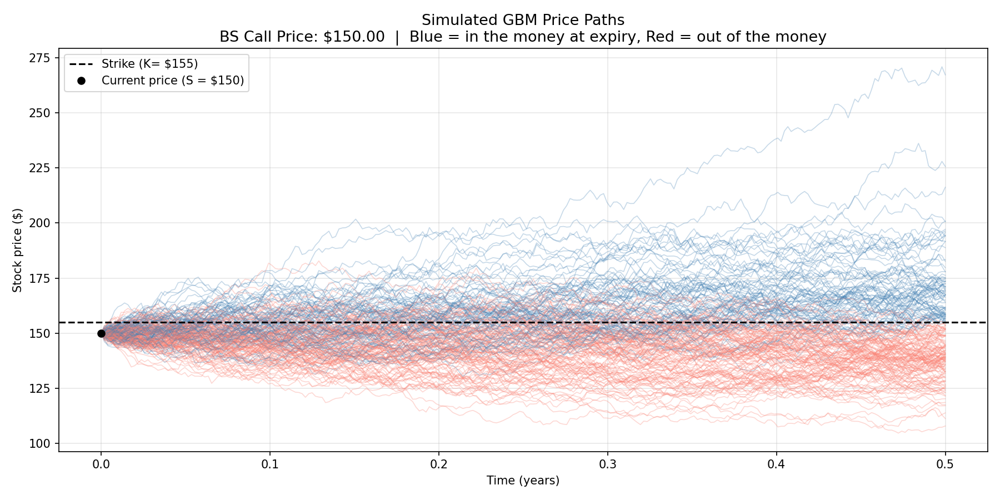
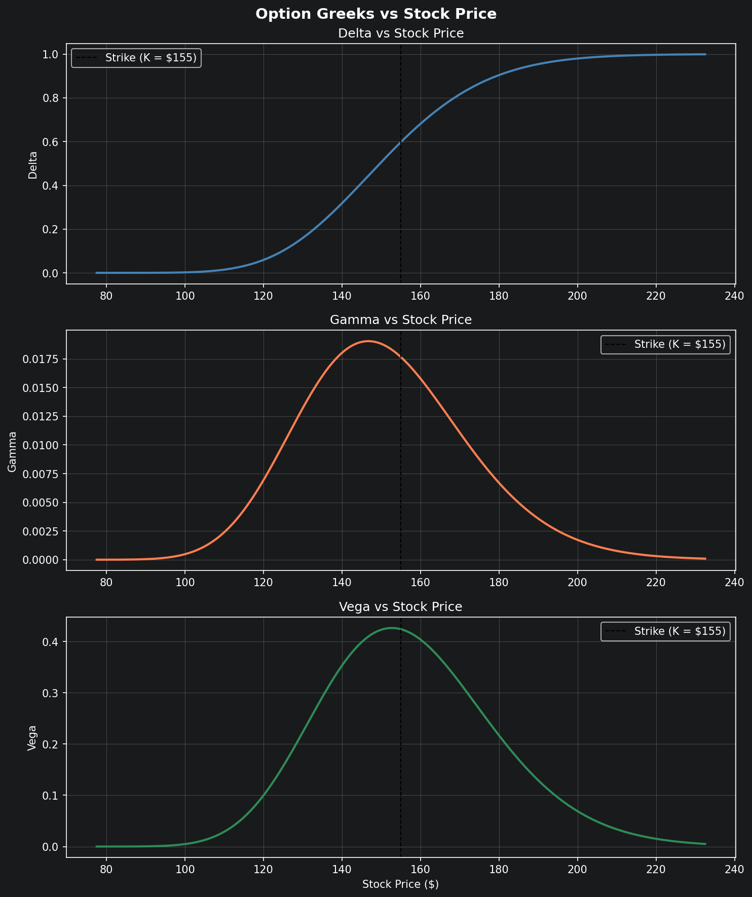
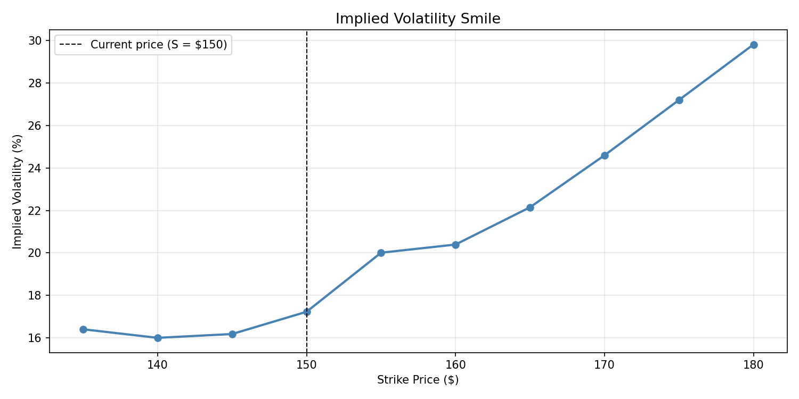
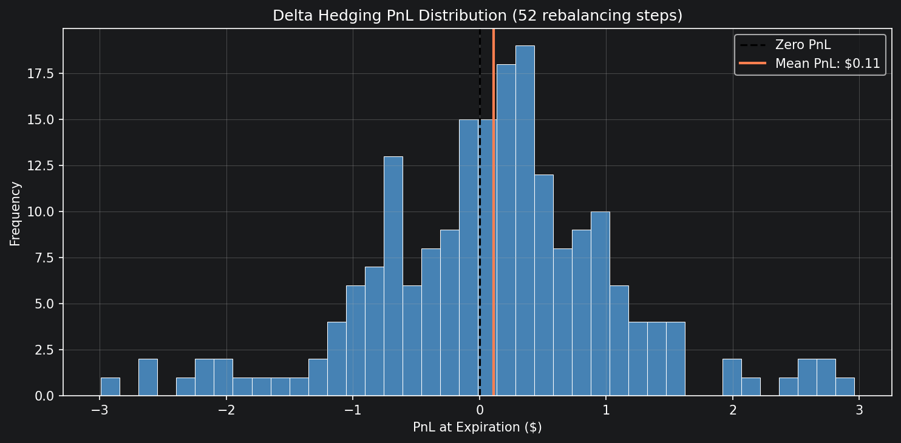

# Black-Scholes Options Pricer & Monte Carlo Simulator

A Python implementation of the Black-Scholes options pricing model, Monte Carlo 
simulation, Greeks calculation, implied volatility extraction, and delta hedging 
simulation.

Built as a learning project to understand the mathematical foundations of 
quantitative finance.

---

## Project Structure

    black-scholes-mc/
      src/
        black_scholes.py     # Closed-form BS pricer for calls and puts
        monte_carlo.py       # Monte Carlo simulation using GBM
        greeks.py            # Delta, Gamma, Vega, Theta, Rho
        implied_vol.py       # Implied volatility extraction via Brent's method
        visualize.py         # GBM price path visualization
        visualize_greeks.py  # Greeks curves across stock prices
        delta_hedge.py       # Dynamic delta hedging simulation
      plots/
        price_paths.png
        greeks.png
        vol_smile.png
        delta_hedge.png
      requirements.txt

---

## The Math

### Black-Scholes Formula

The Black-Scholes model prices a call option under the assumption that 
stock prices follow Geometric Brownian Motion:

$$S_T = S_0 \cdot \exp\left(\left(r - \frac{\sigma^2}{2}\right)T + \sigma\sqrt{T} \cdot Z\right)$$

where $Z \sim \mathcal{N}(0, 1)$.

The closed-form call price is:

$$C = S_0 \cdot N(d_1) - K \cdot e^{-rT} \cdot N(d_2)$$

$$d_1 = \frac{\ln\left(\frac{S_0}{K}\right) + \left(r + \frac{\sigma^2}{2}\right)T}{\sigma\sqrt{T}}, \quad d_2 = d_1 - \sigma\sqrt{T}$$

The formula has a clean interpretation: it is the expected stock contribution to 
the payoff minus the discounted expected cost of exercising, each weighted by 
their relevant probability.

- $N(d_2)$ - risk-neutral probability the option expires in the money
- $N(d_1)$ - probability weighted by the size of the stock's contribution to the payoff

Put prices follow from put-call parity, which holds exactly by no-arbitrage:

$$C - P = S_0 - K \cdot e^{-rT}$$

### Monte Carlo Simulation

Instead of the closed-form solution, we simulate $N$ price paths under GBM and 
average the discounted payoffs:

$$\hat{C} = e^{-rT} \cdot \frac{1}{N} \sum_{i=1}^{N} \max(S_T^{(i)} - K,\ 0)$$

The MC price converges to the BS price as $N \to \infty$. With 100,000 
simulations the two prices typically agree to within a few cents.

### The Greeks

Sensitivities of the option price to each input:

| Greek | Measures | Formula |
|-------|----------|---------|
| Delta | Sensitivity to stock price | $N(d_1)$ |
| Gamma | Rate of change of Delta | $\frac{N'(d_1)}{S \sigma \sqrt{T}}$ |
| Vega | Sensitivity to volatility | $S \cdot N'(d_1) \cdot \sqrt{T}$ |
| Theta | Time decay per day | See src/greeks.py |
| Rho | Sensitivity to interest rates | $K T e^{-rT} N(d_2)$ |

where $N(\cdot)$ denotes the standard normal CDF and $N'(\cdot)$ its derivative, the PDF.

Delta follows an S-curve from 0 to 1 as the stock price rises through the strike. 
Gamma and Vega both peak at the money, where the option is most sensitive to 
changes in the underlying.

### Implied Volatility

Volatility is the only unobservable input to Black-Scholes. Given a market price, 
we invert the formula numerically using Brent's method to extract the implied 
volatility, the market's collective estimate of future uncertainty.

Plotting implied vol across strikes reveals the volatility skew: out of the money 
options trade at higher implied vol than at the money options, reflecting the 
market's fear of tail risk not captured by the normal distribution assumption.

### Delta Hedging

A delta hedge eliminates directional exposure to the stock. If you sell a call 
with Delta 0.50, you buy 0.50 shares per option sold. As the stock moves, Delta 
changes (Gamma), so the hedge must be rebalanced periodically.

With weekly rebalancing (52 steps) over 200 simulated paths, the mean hedging 
PnL is approximately $0.01 with a standard deviation of ~$1.10, demonstrating 
that discrete delta hedging closely replicates the theoretical zero-cost continuous 
hedge of Black-Scholes.

---

## Results

### Simulated GBM Price Paths


### Option Greeks vs Stock Price


### Implied Volatility Smile


### Delta Hedging PnL Distribution


---

## Installation

```bash
git clone https://github.com/AgustinMagarinos/black-scholes-mc.git
cd black-scholes-mc
pip install -r requirements.txt
```

## Usage

```bash
# Run the Black-Scholes pricer
python src/black_scholes.py

# Run Monte Carlo simulation
python src/monte_carlo.py

# Calculate Greeks
python src/greeks.py

# Extract implied volatility
python src/implied_vol.py

# Generate visualizations
python src/visualize.py
python src/visualize_greeks.py
python src/delta_hedge.py
```

---

## Key Concepts Demonstrated

- Log-normal stock price modeling under risk-neutral measure
- No-arbitrage pricing and put-call parity
- Monte Carlo convergence as a function of simulation count
- Greeks as partial derivatives of the pricing formula
- Volatility skew as evidence of Black-Scholes model limitations
- Discrete delta hedging error as a function of rebalancing frequency

---

## References

- Black, F. & Scholes, M. (1973). *The Pricing of Options and Corporate Liabilities*
- Hull, J. (2022). *Options, Futures, and Other Derivatives*
- Shreve, S. (2004). *Stochastic Calculus for Finance*